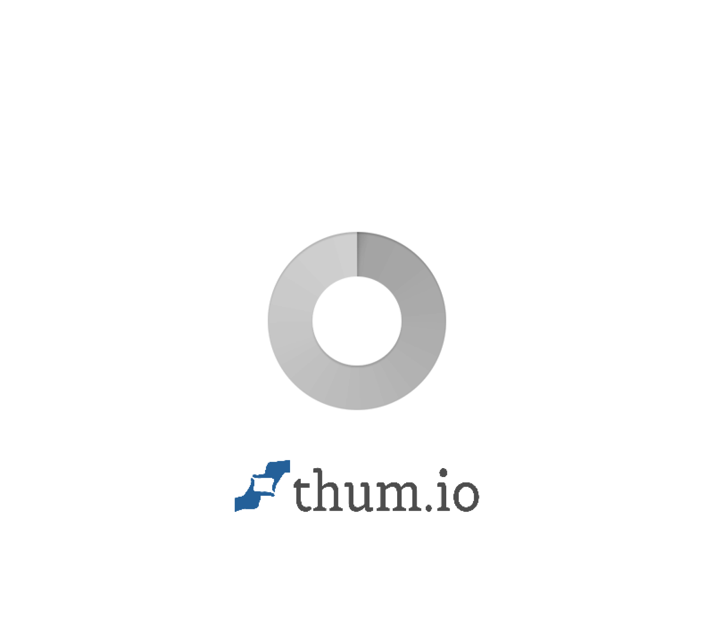

# AWS AI Builder Hackathon Lab: Craft with AI and Build with AI
## Operations Intelligence Agent

> A Document Intelligence System built for the AWS Clash of Agents Challenge using LlamaIndex Workflow, Amazon Bedrock Knowledge Bases, and AgentCore Runtime.

---

## Live Demo

**Website:** [https://dxoecztual878.cloudfront.net/operations-intelligence.html](https://dxoecztual878.cloudfront.net/operations-intelligence.html)

### Dashboard Screenshot



---

## Project Overview

This project implements an **Operations Intelligence Agent** that extracts, processes, and queries structured data from business documents (Orders, Invoices, Catalogs) using AI-powered document extraction and multi-agent orchestration.

### What We Built

| Component | Description |
|-----------|-------------|
| **Document Extraction** | Used LlamaCloud LlamaExtract to parse PDFs into structured JSON |
| **Knowledge Bases** | Created 3 Amazon Bedrock Knowledge Bases for Orders, Invoices, Catalogs |
| **Multi-Agent System** | Specialist agents route queries to appropriate knowledge bases |
| **AgentCore Runtime** | Deployed LangGraph agent to Bedrock AgentCore |
| **Web Interface** | Interactive dashboard hosted on CloudFront |
| **Coder Templates** | Infrastructure-as-Code templates for reproducible deployments |

---

## Architecture Overview

```
┌─────────────────────────────────────────────────────────────────────────────┐
│                     OPERATIONS INTELLIGENCE AGENT                            │
├─────────────────────────────────────────────────────────────────────────────┤
│                                                                              │
│  ┌──────────────┐    ┌──────────────┐    ┌──────────────┐                   │
│  │   PDF Docs   │    │   PDF Docs   │    │   PDF Docs   │                   │
│  │   (Orders)   │    │  (Invoices)  │    │  (Catalogs)  │                   │
│  └──────┬───────┘    └──────┬───────┘    └──────┬───────┘                   │
│         │                   │                   │                            │
│         └───────────────────┼───────────────────┘                            │
│                             ▼                                                │
│              ┌──────────────────────────┐                                    │
│              │    LlamaCloud Extract    │                                    │
│              │   (Document Processing)  │                                    │
│              └──────────────┬───────────┘                                    │
│                             │                                                │
│         ┌───────────────────┼───────────────────┐                            │
│         ▼                   ▼                   ▼                            │
│  ┌─────────────┐    ┌─────────────┐    ┌─────────────┐                      │
│  │  Orders KB  │    │ Invoices KB │    │ Catalogs KB │                      │
│  │  (Bedrock)  │    │  (Bedrock)  │    │  (Bedrock)  │                      │
│  └──────┬──────┘    └──────┬──────┘    └──────┬──────┘                      │
│         │                  │                  │                              │
│         └──────────────────┼──────────────────┘                              │
│                            ▼                                                 │
│              ┌─────────────────────────┐                                     │
│              │    AgentCore Runtime    │                                     │
│              │  (LangGraph/Strands)    │                                     │
│              └────────────┬────────────┘                                     │
│                           │                                                  │
│                           ▼                                                  │
│              ┌─────────────────────────┐                                     │
│              │   CloudFront + S3       │                                     │
│              │   (Web Interface)       │                                     │
│              └─────────────────────────┘                                     │
│                                                                              │
└─────────────────────────────────────────────────────────────────────────────┘
```

---

## AWS Services Used

| Service | Purpose | Use Case |
|---------|---------|----------|
| **Amazon Bedrock** | Foundation models & Knowledge Bases | Powers AI responses and vector search |
| **Amazon Bedrock AgentCore** | Agent runtime hosting | Deploys and runs LangGraph agents |
| **Amazon S3** | Object storage | Stores documents, extracted data, and web assets |
| **Amazon CloudFront** | CDN | Serves web interface globally with low latency |
| **AWS Lambda** | Serverless compute | Document processing and KB queries |
| **Amazon OpenSearch Serverless** | Vector database | Stores embeddings for Knowledge Bases |
| **AWS CloudFormation** | Infrastructure as Code | Deploys Knowledge Base infrastructure |
| **AWS Secrets Manager** | Secrets storage | Stores API keys securely |
| **Amazon CloudWatch** | Monitoring & Logs | Agent observability and debugging |
| **AWS IAM** | Access management | Role-based permissions for services |

---

## Component Details

### 1. LlamaCloud LlamaExtract
**What it does:** Extracts structured data from unstructured PDF documents using AI.

```
Input: Raw PDF files (orders, invoices, catalogs)
Output: Structured JSON with Pydantic schema validation
```

**Use Case:** Convert messy business documents into queryable structured data automatically.

---

### 2. Amazon Bedrock Knowledge Bases
**What it does:** Vector database that enables semantic search over documents.

| Knowledge Base | Documents | Purpose |
|----------------|-----------|---------|
| Orders KB | 4 | Customer order lookup |
| Invoices KB | 4 | Supplier invoice queries |
| Catalogs KB | 2 | Product catalog search |

**Use Case:** Ask natural language questions like "What orders did Jane Doe place?" and get accurate answers.

---

### 3. Amazon Bedrock AgentCore
**What it does:** Serverless runtime for deploying AI agents with tools and memory.

**Use Case:** Deploy production-ready agents that can query multiple knowledge bases and execute tools.

---

### 4. LangGraph Agent
**What it does:** Orchestrates multi-step reasoning with tool calling capabilities.

**Use Case:** Route user queries to the correct specialist agent (Orders, Invoices, or Catalogs).

---

### 5. CloudFront + S3 Web Interface
**What it does:** Hosts a responsive dashboard for querying the intelligence system.

**Features:**
- Tabular data display (not JSON)
- Clickable agent badges to filter by type
- Real-time query processing
- Mobile-responsive design

---

## Project Structure

```
├── README.md
├── architecture/
│   └── ARCHITECTURE.md
├── screenshots/
│   └── dashboard-main.gif
└── src/
    ├── document-extraction/
    │   └── process_documents.py      # LlamaCloud extraction script
    ├── web-interface/
    │   └── index.html                # Interactive dashboard
    ├── coder-templates/
    │   ├── docintel-workflow-pulumi-ld/
    │   │   └── main.tf               # Pulumi + LaunchDarkly template
    │   └── docintel-workflow-arize-llama/
    │       └── main.tf               # Arize + LlamaIndex template
    └── langgraph-agent/
        ├── main.py                   # LangGraph agent code
        └── pyproject.toml            # Dependencies
```

---

## Coder Templates Created

| Template Name | MCP Servers | Purpose |
|---------------|-------------|---------|
| `docintel-workflow-pulumi-ld` | Pulumi + LaunchDarkly | Infrastructure automation with feature flags |
| `docintel-workflow-arize-llama` | Arize + LlamaIndex | AI observability and RAG pipelines |

---

## Key Metrics

| Metric | Value |
|--------|-------|
| Documents Processed | 10 |
| Knowledge Bases | 3 |
| Agent Framework | LangGraph |
| Deployment Region | us-west-2 |
| Web Interface | CloudFront CDN |

---

## Technologies Stack

- **Document Processing:** LlamaCloud, LlamaIndex
- **AI/ML:** Amazon Bedrock (Claude), OpenSearch Serverless
- **Agent Framework:** LangGraph, Strands
- **Infrastructure:** CloudFormation, Pulumi, Terraform
- **Observability:** Arize, CloudWatch
- **Feature Management:** LaunchDarkly
- **Deployment:** Coder Templates, AgentCore Runtime

---

## Built For

**AWS Clash of Agents Challenge** - LlamaIndex Document Extraction Track

---

*Built with Amazon Bedrock, LlamaIndex, and AgentCore*
